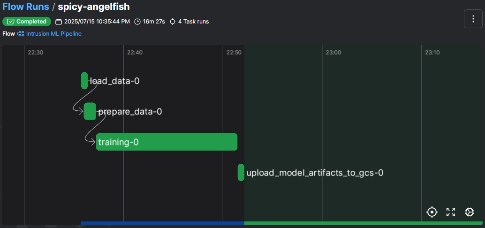
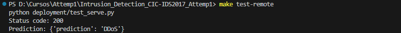
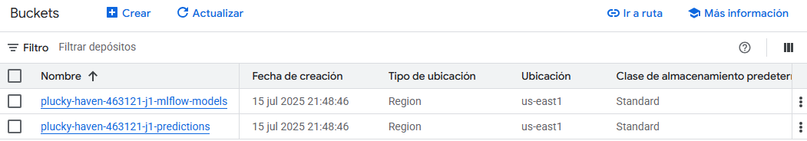
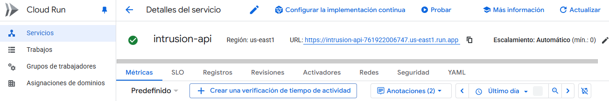
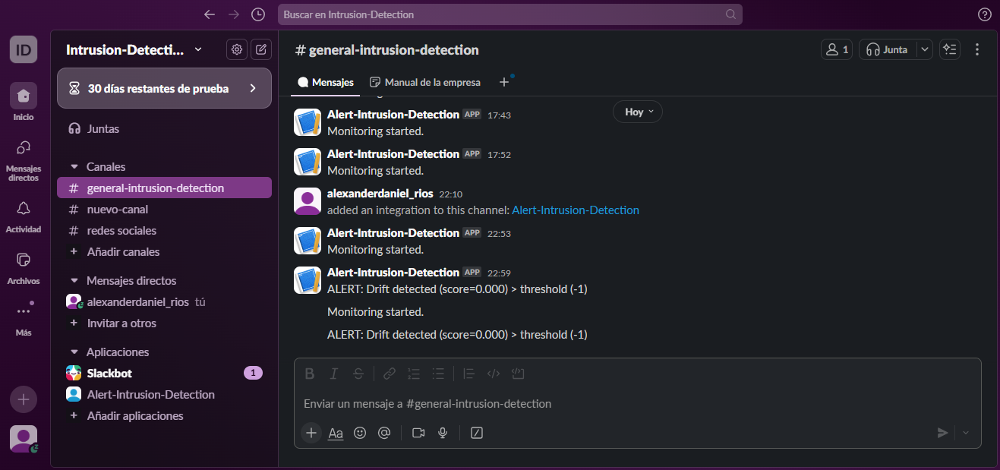
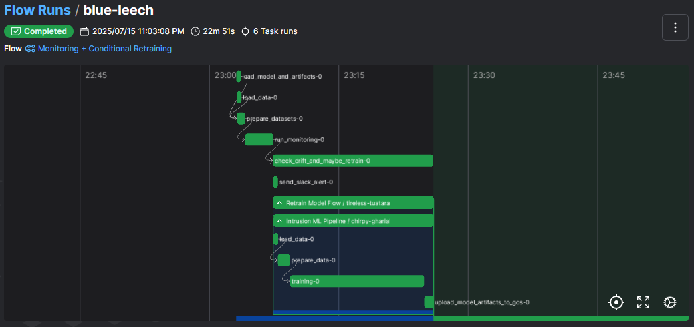
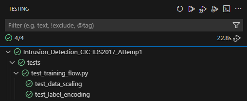

# Intrusion Detection (CIC-IDS2017) - Attemp1

## Problem Description

This project focuses on building a machine learning system for **multi-class network intrusion detection**, based on the **CIC-IDS2017 dataset**. The goal is to develop a reliable and scalable classifier capable of identifying different types of malicious network traffic alongside normal (benign) activity.

### 📦 Dataset: CIC-IDS2017

The **CIC-IDS2017 dataset** was created by the Canadian Institute for Cybersecurity (CIC) and is widely used in academic and industry research on cybersecurity. Unlike many older datasets (e.g., KDD99), CIC-IDS2017 provides **realistic and up-to-date traffic scenarios** that reflect modern network architectures and attack types.

Key characteristics:
- Includes **7 days of traffic** collected using real human behavior profiles
- Contains over **2.8 million labeled flow records**
- Features more than **80 attributes** per connection, including:
  - Flow duration
  - Packet length statistics
  - Inter-arrival times
  - TCP/UDP flag counts
  - Byte and packet rates
  - Header and payload-based features

The dataset includes the following **attack categories**:
- **DoS** (Denial of Service)
- **DDoS** (Distributed DoS)
- **PortScan**
- **Botnet**
- **BruteForce (SSH, FTP)**
- **Web Attacks (XSS, SQL Injection, Command Injection)**
- **Infiltration**
- **Heartbleed**
- And **Benign** (normal) traffic

This project focuses on **multi-class classification**, where the model must distinguish between these attack types and benign traffic.

---

### 🎯 Goal

To train, deploy, and monitor a **multi-class classifier** that can detect the presence and type of a network intrusion, based on extracted features from network flows.

The core ML model used is an **XGBoost Classifier (XGBClassifier)**, which offers robust performance and handles class imbalance effectively — a common issue in intrusion detection datasets.

---

### ⚙️ Technologies and Architecture

The project is designed to be **production-ready** and fully reproducible. It integrates modern MLOps tools and practices:

- **MLflow**: for experiment tracking and model registry
- **Prefect**: to orchestrate the training pipeline and inference workflows
- **FastAPI**: to serve the model as a RESTful API
- **Docker**: to containerize the API for portability and deployment
- **Terraform**: to provision infrastructure (e.g., GCP Storage, Cloud Run)
- **Google Cloud Platform (GCP)**: to host model artifacts, logs, and API services
- **Evidently (coming up)**: to monitor model performance and detect data drift

---

This project simulates a real-world production environment, applying the full ML lifecycle: **data preprocessing → training → evaluation → deployment → monitoring**, using cloud-native and open-source tools. It aims to demonstrate how machine learning can be effectively applied to improve **network security** through automation and intelligent threat classification.

### 📁 Project Structure
The following is a simplified view of the project’s directory layout, focusing only on the key components involved in training, deployment, monitoring, and orchestration:

```bash
.
├── Makefile                    # Main interface to manage the project
├── Dockerfile                  # Defines how to containerize the FastAPI app
├── .env                        # Environment variables (e.g., Slack webhook)
├── Pipfile / requirements.txt # Python dependencies
├── mlflow.db                   # Local MLflow tracking store
├── README.md                   # Project documentation
│
├── data/                       # Preprocessed datasets
│   ├── train.parquet
│   ├── val.parquet
│   └── test.parquet
│
├── models/                     # Saved scaler and label encoder
│   ├── scaler.pkl
│   └── le.pkl
│
├── output/                     # Inference predictions
│   └── predictions.parquet
│
├── pipelines/                  # Prefect flows
│   ├── training_flow.py        # Training pipeline
│   └── batch_inference.py      # Batch prediction script
│
├── deployment/                 # FastAPI service and integration tests
│   ├── serve.py                # API server using FastAPI
│   └── test_serve.py           # Test for endpoint correctness
│
├── monitoring/                 # Model drift and performance checks
│   ├── monitor.py              # Script that runs Evidently
│   └── full_monitor_report.html
│
├── infra/                      # Terraform infrastructure setup
│   ├── main.tf                 # GCP bucket + Cloud Run service
│   ├── variables.tf
│   └── terraform.tfvars
│
├── notebooks/                  # Jupyter notebooks for exploration
│   └── Intrusion_Detection_CIC-IDS2017_Attemp1_RiosAlexanderDaniel.ipynb
│
├── tests/                      # Unit and integration tests
│   ├── test_training_flow.py
│   ├── integration_api_test.py
│   └── __init__.py
│
└── .github/workflows/          # CI configuration
    └── ci.yml                  # GitHub Actions for test + lint
```

This structure enables full reproducibility and modular control over every component of the ML lifecycle, from training and evaluation to cloud deployment and production monitoring.

## 🧭 Project Usage Guide

This section provides a step-by-step explanation of how to execute each component of the project using the provided `Makefile`, covering **environment setup**, **training**, **serving**, **monitoring**, **Docker packaging**, **infrastructure provisioning**, and **testing**.

---

### 🧪 1. Environment Setup

Before running any component, ensure your system has the required tools: Python (≥3.10), [Pipenv](https://pipenv.pypa.io), [Docker](https://www.docker.com/), [Terraform](https://developer.hashicorp.com/terraform), and the [Google Cloud SDK](https://cloud.google.com/sdk).

Start by installing the Python dependencies with:

```bash
make install
```

This will create a virtual environment and install all dependencies listed in the `Pipfile`.

To activate the environment, use:

```bash
make shell
```

Ensure you also have a `.env` file in your root folder with secrets like:

```env
SLACK_WEBHOOK_URL=https://hooks.slack.com/services/...
```

---

### ⚙️ 2. Training Pipeline with Prefect and MLflow

Training is orchestrated with **Prefect 2**, and experiments are tracked using **MLflow**.

To start the MLflow server locally:

```bash
make run-mlflow
```

This launches MLflow on `http://localhost:5000` using SQLite and a local `./models` directory for artifacts.

Next, start the Prefect orchestration backend:

```bash
make run-prefect
```

Now trigger the full training pipeline:

```bash
make run-training
```

This executes the flow defined in `pipelines/training_flow.py`, performing data loading, preprocessing, model training, evaluation, registration in MLflow, and logging of artifacts.



Artifacts such as `scaler.pkl` and `le.pkl` are saved, and predictions are exported to `output/predictions.parquet`.

---

### 🚀 3. API Serving with FastAPI and Docker

Once the model is trained and saved, you can serve it through a local FastAPI container. To build and run the service locally:

```bash
make run-api
```

This builds the Docker image and runs it at `http://localhost:8080`. You can test the `/predict` endpoint with:

```bash
make test-remote
```



This invokes the test client defined in `deployment/test_serve.py` and prints the response from the live endpoint.

---

### 🧱 4. Docker Build and Deployment to GCP

If you're deploying the model using Google Cloud, first build and tag your container image:

```bash
make build-image
```

Then push the image to **Google Container Registry (GCR)**:

```bash
make push-image
```

Make sure you're authenticated with your GCP project using:

```bash
gcloud auth login
gcloud config set project YOUR_PROJECT_ID
```

Update the `Makefile` variables `IMAGE_NAME` and `TAG` accordingly to match your GCR repository.

---

### ☁️ 5. Infrastructure Provisioning with Terraform

The infrastructure setup is defined in the `infra/` directory. It includes:

- A Cloud Run service to host the model API
- A public access role for API invocation
- Two GCS buckets: one for predictions and one for MLflow models

To provision the infrastructure:

```bash
make terraform-deploy
```
Buckets:



Services:



To destroy it afterward:

```bash
make terraform-destroy
```

You must define variables such as `project` and `region` in `infra/terraform.tfvars`. Make sure the bucket names in `main.tf` are globally unique or previously created by Terraform.

---

### 📊 6. Monitoring with Evidently

To assess model performance and monitor prediction quality, run:

```bash
make run-monitoring
```

This generates a complete HTML report under `monitoring/full_monitor_report.html` using [Evidently AI](https://www.evidentlyai.com/). The monitoring task compares current predictions with expected test labels and reports on drift, quality, and data statistics.



In addition to the local report, if the data drift exceeds a predefined threshold, the monitoring script automatically triggers a real-time **Slack alert** via a webhook. This allows for proactive detection of model degradation in production environments.



Furthermore, when drift is detected, the monitoring logic **automatically triggers the training pipeline**, launching a new retraining process to adapt the model to current data conditions. This behavior closes the loop between monitoring and adaptation, helping maintain high predictive performance over time.

To enable Slack notifications, make sure to configure your `.env` file with a valid `SLACK_WEBHOOK_URL`.
---

### ✅ 7. Testing and Code Quality

To ensure your code is clean and functional, you can run:

```bash
make lint
```

This triggers `pre-commit` checks defined in `.pre-commit-config.yaml`.

Run the full test suite with:

```bash
make test
```



This executes the unit and integration tests found in the `tests/` folder, including:

- `test_training_flow.py` for the Prefect pipeline
- `integration_api_test.py` for the FastAPI `/predict` endpoint

---

### 🔁 8. CI/CD Integration

The project includes a GitHub Actions workflow defined in `.github/workflows/ci.yml`, which runs tests and linting on each push or pull request.

You can extend this pipeline to include Docker build and deployment, test execution on GCP, and Slack notifications using your environment variables.

If you’re using **GitLab**, you can adapt the workflow into `.gitlab-ci.yml` with equivalent stages (test, build, deploy) using `make` commands for consistency.

---

This structure allows you to **train, serve, deploy, and monitor** your ML model through reproducible commands, providing a production-ready pipeline aligned with modern MLOps standards.

---

### 🛠️ Makefile Usage

This project provides a comprehensive `Makefile` to streamline common development, testing, deployment, and infrastructure tasks. Below are the available commands and how to use them within the terminal from the project root.

To install dependencies, simply run `make install`, which uses `pipenv` to install packages defined in `Pipfile`. If you want to enter a virtual environment shell, use `make shell`.

To execute all tests, type `make test`. This runs all test scripts located inside the `tests/` folder. You can also run static code analysis and style checks using `make lint`, which applies the configured `pre-commit` hooks across all files.

To launch the local monitoring script that produces a full Evidently report based on batch predictions, run `make run-monitoring`. This script generates a visual report stored under `monitoring/full_monitor_report.html`.

To start the local FastAPI service for model inference, first build the container with `make build-image`, then run it locally via `make run-api`. Alternatively, to build and push the container image to Google Cloud using Cloud Build, use `make gcloud-build`.

To run the Prefect orchestration server locally, you can invoke `make run-prefect`. Similarly, `make run-mlflow` launches a local MLflow tracking server for experiment tracking and model versioning.

To train the intrusion detection model, run `make run-training`. This executes the Prefect flow defined in `training_flow.py`, which handles data preprocessing, model training, evaluation, and artifact logging with MLflow. If you want to test the inference pipeline, use `make run-inference` with the appropriate dataset path.

Infrastructure can be deployed to Google Cloud using Terraform. To provision resources like Cloud Run and GCS buckets, run `make terraform-deploy`. To destroy the infrastructure, use `make terraform-destroy`.

Finally, to test the deployed API endpoint on GCP, use `make test-remote`, which executes the script `test_serve.py` to verify remote prediction capability.

All these commands assume a properly configured `.env` file and access to your GCP project. Make sure to authenticate with `gcloud` and set the correct project before deploying.
